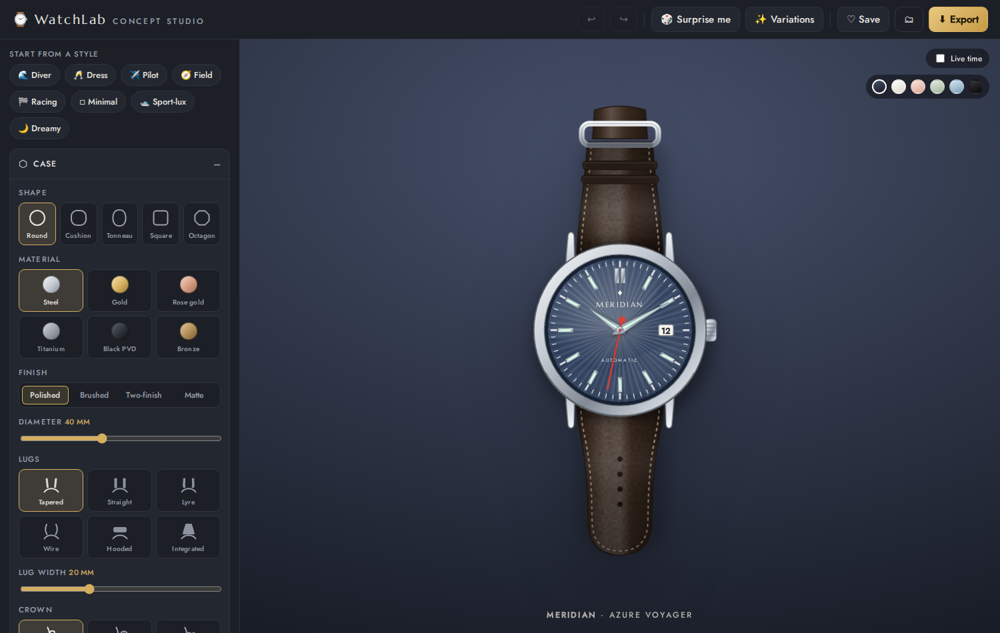
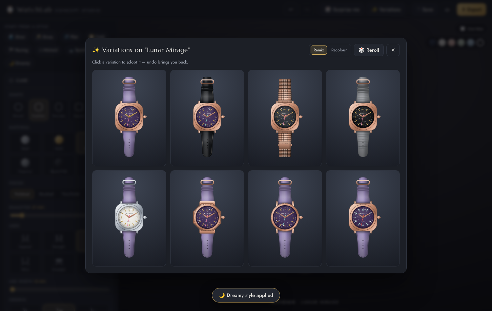
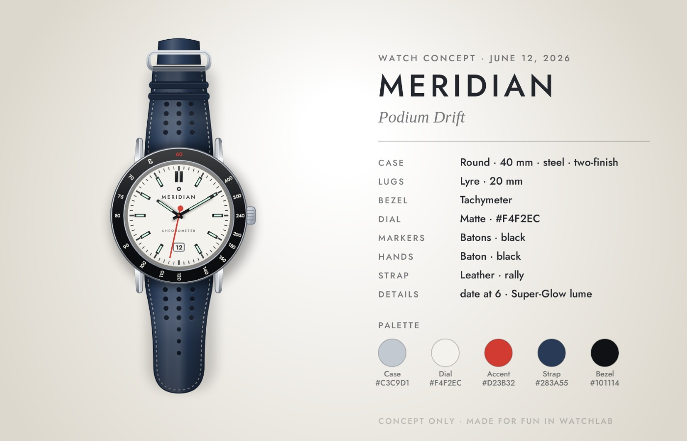

# ⌚ WatchLab — watch concept studio

A playful, visual web app for dreaming up original watch designs. Pick a case, paint a dial,
swap hands and straps, remix the whole thing with one click, and export a presentable concept
sheet — no CAD skills or watchmaking knowledge required. It's for fun and exploration, not
manufacturing.



## What you can design

Every visible element of the watch is adjustable, live:

- **Case** — round, cushion, tonneau, square or octagon · steel, gold, rose gold, titanium, black PVD or bronze · 36–46 mm · polished, brushed, two-finish (with polished chamfers) or matte
- **Lugs & crown** — tapered, straight, lyre, wire, hooded or fully integrated lugs · 18–24 mm lug width · knurled, onion or cabochon crown · optional crown guards
- **Bezel** — polished, fluted, coin-edge, dive (with insert colour), tachymeter, or slim
- **Dial** — 20 curated colours plus a free colour picker · matte, sunburst, guilloché, waves, linen, fumé or starlit textures
- **Minute track** — ticks, railroad, dots, or clean
- **Markers & numerals** — batons, Arabic, Roman, dots, mixed or minimal · metallic, ink, accent or lume finishes · five typefaces
- **Hands** — dauphine, sword, baton, Mercedes, syringe, snowflake or leaf · six finishes incl. heat-blued · optional lume
- **Logo & text** — brand name, model name, dial caption, emblem mark, above/below placement, brand typeface
- **Extras** — date window at 3 or 6, accent colour for the seconds hand and details
- **Strap** — leather (smooth, grained, alligator or perforated rally), rubber, striped NATO, link bracelet, five-link, President, or Milanese mesh — rendered with the cues of real flat-lay product shots: a single light source, value falloff and link foreshortening along the band, scalloped link silhouettes, contoured end links and a detailed deployant clasp

## Creative tools

- 🎲 **Surprise me** — generates a coherent random concept (built on style archetypes, so results stay believable)
- ✨ **Variations** — a grid of eight remixes or recolours of your current design; click one to adopt it
- 🧭 **Style presets** — Diver, Dress, Pilot, Field, Racing, Minimal, Sport-lux and Dreamy starting points
- ↩ **Undo / redo**, autosave, and a ♡ **gallery** of saved designs (stored in your browser)
- 🕙 **Live time** toggle, plus six studio backdrops for staging



## Export

Three one-click exports, rendered at high resolution with the bundled typefaces embedded:

- 📋 **Concept sheet** — watch render, specs, and colour palette on a styled card
- 🖼 **Studio render** — PNG on the current backdrop
- ✂️ **Cut-out render** — transparent PNG



## Running it

```bash
npm install
npm run dev      # local dev server
npm run build    # type-check + production build (dist/)
npm run preview  # serve the production build
```

No backend, no accounts — everything runs in the browser and persists to `localStorage`.

## How it works

The watch is a single parametric SVG renderer (`src/render/WatchSVG.tsx`) driven by one
serialisable `WatchDesign` object (`src/model/types.ts`). Everything else — presets,
randomiser, variation mutators, exports — just produces or consumes that object.
Exports rasterise the live SVG onto a canvas, inlining the woff2 fonts as data URIs so
typography survives the trip.
